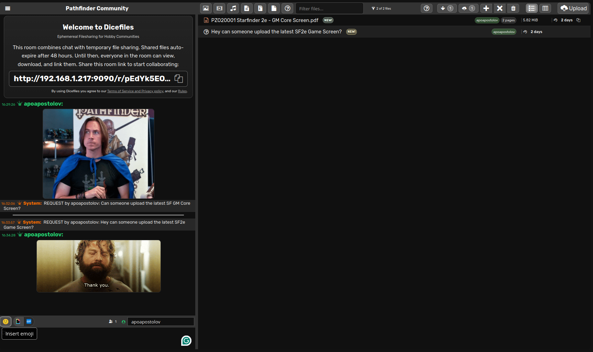
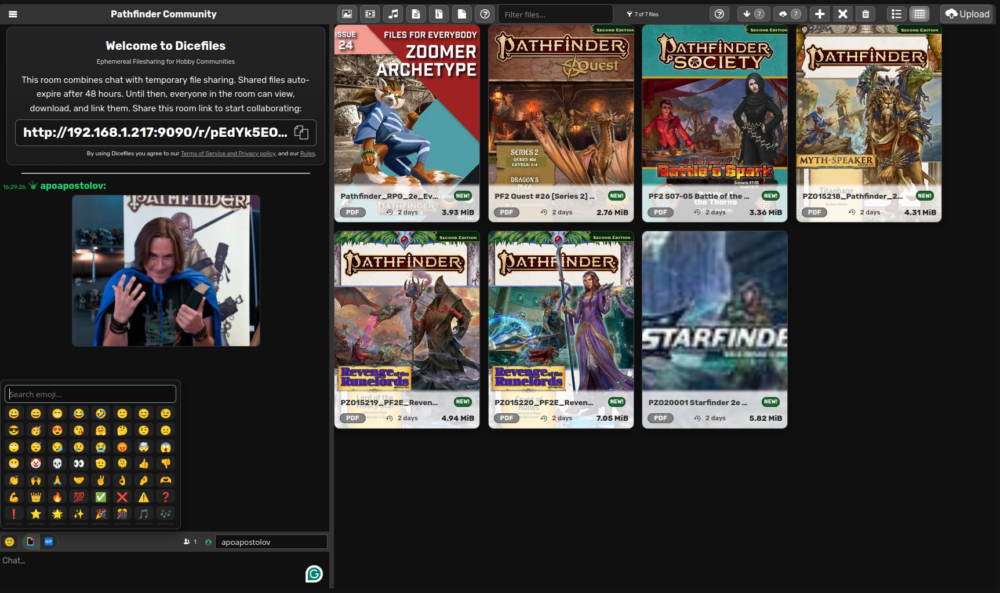

# Dicefiles - Ephemereal Filesharing for Hobby Communities


Dicefiles is a self-hosted, open-source file sharing platform for hobby communities, forked from Volafile and Kregfile, and extended with new automation features, quick downloading for archival purposes, and an improved in-room request flow. It is ideal for sharing roleplaying books, digital maps, board games, STL models, fiction, and more.

<p align="center">
  
  
</p>

> **Note:** This is a self-hosted application. You must host it yourself - there is no public service provided.

## Features

- Real-time chat rooms with file sharing, inline media embedding, and GIF provider integrations
- User accounts and moderation with login lockout protection
- File previews for images, videos, audio, PDFs, and book covers
- **In-page streaming reader** for PDF, ePub, MOBI, and comics (CBZ/CBR/CB7) with progress persistence, focus mode, typography options, and A5 paginated layout
- **Archive Viewer** for browsing and selective downloading from ZIP, RAR, 7Z, TAR, and multi-part archives
- Request system with fulfillment workflow, optional links/images, status pills, and room-level enable/disable
- Links Archive with automatic URL capture and optional opengraph.io title enrichment
- Batch download actions for All/New files with progress tracking, concurrency control, and resumable queues
- NEW badges for unseen files and requests with awareness highlighting
- Per-user file cleanup and per-account activity tracking
- Expanded profiles with editable messages, achievement progression (rarity tiers), and Latest Activity tabs
- **Public Room Directory** when enabled, showing live stats for all registered rooms
- Room options for requests and link collection, plus automatic room pruning
- Room creation and management
- Configurable limits, flood control, and retention policies
- TLS/HTTPS support with Helmet security headers
- Automation API with scoped keys, rate limiting, webhooks, and MCP server for AI clients
- Health endpoint with Redis/storage checks and operational metrics
- Centralized input validation, security audits, and regression testing

## In-Page Document and Comic Reader

Dicefiles includes a built-in streaming reader for **PDF**, **ePub**, **MOBI**, and **comic** files. It requires no additional server-side tooling — all parsing and rendering runs entirely in the browser.

### How it works

1. Switch to gallery mode (grid icon in the toolbar) and click a PDF or ePub file.
2. The cover image appears in the gallery overlay.
3. A persistent **Read Now** button is visible in the lower area of the cover.
4. Clicking **Read Now** closes the overlay and opens the reader, which fills the file-list area.

### PDF reader

- Powered by [Mozilla PDF.js](https://mozilla.github.io/pdf.js/) (`pdfjs-dist`, Apache-2.0).
- Pages are fetched via **HTTP Range requests** — the server's existing `Accept-Ranges: bytes` configuration is sufficient, no changes needed.
- Rendering is **lazy**: only pages within ~300 px of the viewport are decoded; all other pages are lightweight placeholders. Opening a 500-page document is instant.
- Page scale is auto-fitted to the reader width — no CSS up-scaling artifacts.
- **Zoom pill** (`−` / `+`) re-renders pages at the new scale in 0.25× steps.
- **Download** button saves the file without closing the reader.
- Page counter in the toolbar tracks the currently visible page.

### ePub reader

- Parsed natively in the browser using [JSZip](https://stuk.github.io/jszip/) (`jszip`, MIT) — no server-side extraction.
- OPF manifest and spine are parsed to build the chapter list; CSS and image assets are extracted and served as `blob:` URLs so chapters render correctly without network requests.
- Chapters render in a `srcdoc` iframe (no `sandbox` restrictions) with injected dark-theme defaults and A5 page layout via CSS multi-column.
- Content reflows into horizontal A5-sized pages within each chapter — ← / → arrow keys and **Prev / Next** buttons scroll pages; **PageUp / PageDown** jump chapters.
- Chapter + page counter in the toolbar.

### MOBI / AZW / AZW3 reader

- Parsed natively in the browser using [`@lingo-reader/mobi-parser`](https://github.com/hhk-png/lingo-reader) (MIT) — no conversion or server-side processing.
- Spine items and chapter HTML are read directly from the MOBI binary; embedded images become `blob:` URLs automatically.
- Same A5 paginated rendering as ePub: ← / → scroll pages, **PageUp / PageDown** change chapters.

### Comic reader

- Supports CBZ (ZIP), CBR (RAR), and CB7 (7Z) formats.
- CBZ parsed client-side using [JSZip](https://stuk.github.io/jszip/) (MIT); CBR and CB7 require server-side extraction via system tools (`unrar`, `p7zip-full`).
- Renders as a sequential image viewer with ← / → navigation for pages.
- Page counter in the toolbar tracks the current page.

### Closing the reader

Press **Escape** or click the **✕** button in the toolbar to close the reader and return to the file list.

### npm packages (installed automatically via `yarn install`)

| Package                     | Version     | License    | Purpose                                 |
| --------------------------- | ----------- | ---------- | --------------------------------------- |
| `pdfjs-dist`                | `^3.11.174` | Apache-2.0 | PDF parsing and canvas rendering        |
| `jszip`                     | `^3.10.1`   | MIT        | EPUB ZIP parsing (client-side)          |
| `@lingo-reader/mobi-parser` | `^0.4.5`    | MIT        | MOBI / AZW / AZW3 parsing (client-side) |

The PDF.js web worker is built as a separate webpack entry (`pdf.worker.js`) and served at `/pdf.worker.js`. It is only fetched the first time a user opens a PDF — ordinary room usage incurs no overhead.

> **Important distinction:** the reader packages handle **in-browser reading only**. Server-side **cover thumbnail generation** for PDFs uses GraphicsMagick + Ghostscript; for EPUB it uses `jszip` (already bundled); for MOBI/AZW/AZW3 it uses a pure Node.js PalmDB binary parser (built-in, no extra tooling required). See the [Install Preview Tooling](#15-install-preview-tooling-recommended) section.

## User Profiles

- **Profile message**: If you are viewing your own profile while logged in, you can set a multiline markdown message for visitors.
- **Achievement trophy room**: Achievements unlock across three tracks:
  - Uploaded file count
  - Uploaded total size
  - Downloaded total size
- **Rarity visuals**: Achievement cards use progressive MMO-style rarity colors from common tiers to mythic/ascendant tiers.
- **Stats snapshot**: Profile cards show Total Uploaded, Total Downloaded, Files Uploaded, and unlocked achievement count.

## Documentation

| Document                           | Purpose                                                                                                                                                                                       |
| ---------------------------------- | --------------------------------------------------------------------------------------------------------------------------------------------------------------------------------------------- |
| [INTRODUCTION.md](INTRODUCTION.md) | Complete guide to Dicefiles, use cases, and getting started                                                                                                                                   |
| [CHANGELOG.md](CHANGELOG.md)       | Version history and release notes                                                                                                                                                             |
| [API.md](API.md)                   | REST Automation API reference — all `/api/v1` endpoints, authentication, scopes, rate limits, and webhook events. Start here to build bots, scripts, or integrations against a live instance. |
| [MCP.md](MCP.md)                   | Model Context Protocol server reference — setup for Claude Desktop, VS Code, Cursor, Codex CLI, OpenCode CLI, and OpenClaw. Covers all 13 MCP tools and worked multi-step workflow examples.  |

---

## AI-Assisted Setup (OpenClaw)

If you are an AI agent (OpenClaw, Claude, Codex, or any MCP-capable orchestrator), paste the
prompt below to automate the full Dicefiles installation, MCP server wiring, and skill
registration in one shot.

> **For humans:** skip to [Quick Start](#quick-start-choose-your-os) for the manual
> step-by-step instructions.

````
You are setting up Dicefiles on this machine. Work through these steps in order:

## 1 — Clone and install
```bash
git clone https://github.com/apoapostolov/Dicefiles-Ephemereal-Filesharing.git Dicefiles
cd Dicefiles
npm install
```

## 2 — Generate a config
Create `.config.json` from the provided example:
```bash
cp .config.json.example .config.json
```
Open `.config.json` and:
- Replace `"secret"` with 64 random hex characters (run:
  `node -e "console.log(require('crypto').randomBytes(32).toString('hex'))"`)
- Set `"name"` and `"motto"` to taste.
- Set `"port"` (default 9090)
- Add at least one automation API key under `"automationApiKeys"` with scopes
  `["files:read","uploads:write","requests:write","rooms:write"]`.
  Keep the key value in your secrets manager.

## 3 — Build and start
```bash
node ./node_modules/webpack-cli/bin/cli.js --mode=production
node server.js &
curl -sI http://127.0.0.1:$(node -e "const c=require('./.config.json');console.log(c.port||9090)")/ | head -1
```
Confirm `HTTP/1.1 200` before proceeding.

## 4 — Install the MCP server (stdio)
Add the following entry to your MCP client config (`~/.config/mcporter.json`,
`~/.cursor/mcp.json`, `~/.codex/config.toml`, etc. — see `MCP.md` § 2 for
client-specific formats):

```json
{
  "mcpServers": {
    "dicefiles": {
      "command": "node",
      "args": ["/absolute/path/to/Dicefiles/scripts/mcp-server.js"],
      "env": {
        "DICEFILES_BASE_URL": "http://localhost:9090",
        "DICEFILES_API_KEY": "<your-automation-key-from-step-2>"
      }
    }
  }
}
```

Smoke-test:
```bash
DICEFILES_BASE_URL=http://localhost:9090 \
DICEFILES_API_KEY=<your-key> \
node scripts/mcp-server.js
# → [dicefiles-mcp] Stdio transport ready. Waiting for MCP client...
```

## 5 — Install the OpenClaw agent skill
```bash
mkdir -p ~/.claude/skills/dicefiles
cp /absolute/path/to/Dicefiles/scripts/openclaw-dicefiles-skill/SKILL.md \
   ~/.claude/skills/dicefiles/
```
The skill teaches OpenClaw the full 13-tool inventory, startup sequence, and
fulfillment loop. Full skill definition: `scripts/openclaw-dicefiles-skill/SKILL.md`.

## 6 — Verify
- Restart your MCP client and confirm `dicefiles` appears in its tool list.
- Ask the agent: "Use the server_health tool to check my Dicefiles instance."
- Expected: Redis OK, storage OK, uptime counter > 0.
````

---

## Quick Start (Choose Your OS)

### Linux / macOS

**Node.js:**

- Use a current Node.js LTS release
- If you use `nvm`: `curl -o- https://raw.githubusercontent.com/nvm-sh/nvm/v0.40.1/install.sh | bash`

**Windows users: skip to [Windows 11 Setup](#windows-11-setup) below.**

#### 1. Install Redis

**Ubuntu/Debian:**

```bash
sudo apt update
sudo apt install redis-server
sudo systemctl start redis
sudo systemctl enable redis
```

**macOS:**

```bash
brew install redis
brew services start redis
```

Verify Redis is running:

```bash
redis-cli ping
# Should return: PONG
```

#### 1.5 Install Preview Tooling (recommended)

For reliable file previews (especially PDFs), install:

```bash
sudo apt update
sudo apt install -y exiftool ffmpeg graphicsmagick ghostscript p7zip-full

*If you cannot install some of these utilities, the server will still run. "Preview" assets simply won't be generated and your gallery will fall back to the generic file icon — there are no crashes. CB7 comic support requires `p7zip-full`; without it, CB7 files upload successfully but lack previews and reading capabilities.*
```

Notes:

- PDF preview generation uses GraphicsMagick; after install, verify the `gm` command is available (`gm version`).
- If you prefer ImageMagick, install it together with Ghostscript so PDF rendering delegates are available.
- **PDF/ePub/MOBI in-browser reading does not require any of the above tools.** The reader libraries (`pdfjs-dist`, `jszip`, `@lingo-reader/mobi-parser`) are bundled client-side JavaScript. These tools are only needed for generating the small cover thumbnails shown in the file list gallery.

#### 2. Clone and Install

```bash
# Clone the repository
git clone https://github.com/apoapostolov/Dicefiles-Ephemereal-Filesharing.git
cd dicefiles

# Install dependencies
yarn install

# Build client-side code (production mode)
yarn prestart
```

#### 3. Configure

Copy the annotated example and edit it:

```bash
cp .config.json.example .config.json
```

At minimum set `"secret"` to a long random string and choose a `"port"`. See
[Configuration](#configuration) below or the inline comments in `.config.json.example`
for a full description of every option.

#### 4. Start the Server

```bash
yarn start
```

Access at `http://127.0.0.1:9090`

---

### Windows 11 Setup

#### 1. Install Prerequisites

**Node.js (LTS version):**

1. Download a current Node.js LTS release from <https://nodejs.org/>
2. Run the installer (accept defaults)
3. Verify installation:

   ```powershell
   node --version
   ```

**Yarn:**

```powershell
npm install -g yarn
yarn --version
```

**Redis (for Windows):**

**Option A - WSL2 (Recommended for full compatibility):**

1. Enable WSL2: `wsl --install`
2. Install Ubuntu from Microsoft Store
3. In WSL Ubuntu terminal:

   ```bash
   sudo apt update
   sudo apt install redis-server
   sudo service redis-server start
   ```

4. Dicefiles will need to connect to WSL's Redis (IP changes on restart)

**Option B - Memurai (Native Windows Redis):**

1. Download Memurai from <https://www.memurai.com/get-memurai>
2. Install with default settings
3. Memurai installs as a Windows service automatically
4. Verify: `redis-cli ping` (should return `PONG`)

**C++ Compiler (for native modules):**

1. Install Visual Studio Build Tools:
   - Download from <https://visualstudio.microsoft.com/downloads/>
   - Select "Build Tools for Visual Studio 2022"
   - During install, check "Desktop development with C++"

**Optional Preview Tools:**

```powershell
# Install exiftool
# Download from https://exiftool.org/ and extract to a folder in PATH

# Install ffmpeg
# Download from https://ffmpeg.org/download.html
# Extract and add bin folder to PATH

# Install GraphicsMagick (preferred) or ImageMagick + Ghostscript (for PDF previews)
# GraphicsMagick: https://sourceforge.net/projects/graphicsmagick/files/graphicsmagick-binaries/
# ImageMagick: https://imagemagick.org/script/download.php#windows
# Ghostscript: https://ghostscript.com/releases/gsdnld.html

# Install 7-Zip (for CB7 comic support)
# Download from https://www.7-zip.org/
# Extract and add bin folder to PATH
```

#### 2. Clone and Install

Open PowerShell or Command Prompt:

```powershell
# Clone the repository
git clone https://github.com/apoapostolov/Dicefiles-Ephemereal-Filesharing.git
cd dicefiles

# Install dependencies
yarn install

# Build client-side code
yarn prestart
```

#### 3. Configure

Copy the annotated example and edit it:

```powershell
copy .config.json.example .config.json
```

At minimum set `"secret"` and choose a `"port"`. See the inline comments in
`.config.json.example` or the [Configuration](#configuration) section below.

**Note:** `jail` is always disabled on Windows (firejail is Linux-only).

#### 4. Start the Server

```powershell
yarn start
```

Access at `http://127.0.0.1:9090`

---

## Configuration

Configuration files are loaded in this order (last value wins):

1. `defaults.js` - Built-in defaults (do not edit, use as reference)
2. `$HOME/.config/Dicefiles.json`
3. `$HOME/.config/Dicefiles.js`
4. `$PWD/.config.js`
5. `$PWD/.config.json`

### Secret Management

The `secret` config key is used to sign sessions and cookies. **You must change it before deploying to production.**

- If `NODE_ENV=production` and the secret is a known default or shorter than 16 characters, the server will **refuse to start** with a fatal error.
- In development (any other `NODE_ENV`), a warning is logged instead.

**Generate a strong secret:**

```bash
node -e "console.log(require('crypto').randomBytes(32).toString('hex'))"
```

**Set it in `.config.json`:**

```json
{
  "secret": "your-64-char-random-hex-value-here"
}
```

**Secret rotation:** update the `secret` value and restart the server. All existing sessions will be invalidated (users will need to log in again). There is no zero-downtime rotation path at this time.

**Example `.config.json`:**

```json
{
  "name": "My File Share",
  "motto": "Share freely",
  "port": 9090,
  "maxFileSize": 5368709120,
  "jail": false
}
```

**Key options:**

| Option                          | Default                     | Description                                                                                                                                                                                                                                                                                                                                                                                                                                                                                                                                                                                                                                                                                                                                                                                           |
| ------------------------------- | --------------------------- | ----------------------------------------------------------------------------------------------------------------------------------------------------------------------------------------------------------------------------------------------------------------------------------------------------------------------------------------------------------------------------------------------------------------------------------------------------------------------------------------------------------------------------------------------------------------------------------------------------------------------------------------------------------------------------------------------------------------------------------------------------------------------------------------------------- | --- | ------------- | ------- | ------------------------------------------------------------------------------------------------------------------------------------------------------------------------------------------------------- |
| `port`                          | `8080`                      | HTTP listen port                                                                                                                                                                                                                                                                                                                                                                                                                                                                                                                                                                                                                                                                                                                                                                                      |
| `workers`                       | `CPU + 1`                   | Number of web workers                                                                                                                                                                                                                                                                                                                                                                                                                                                                                                                                                                                                                                                                                                                                                                                 |
| `secret`                        | `"Dicefiles"`               | Secret for crypto (change in production)                                                                                                                                                                                                                                                                                                                                                                                                                                                                                                                                                                                                                                                                                                                                                              |
| `uploads`                       | `"uploads"`                 | Upload directory path                                                                                                                                                                                                                                                                                                                                                                                                                                                                                                                                                                                                                                                                                                                                                                                 |
| `maxFileSize`                   | `10GB`                      | Max file size in bytes (0 = unlimited)                                                                                                                                                                                                                                                                                                                                                                                                                                                                                                                                                                                                                                                                                                                                                                |
| `requireAccounts`               | `false`                     | Require accounts to chat/upload                                                                                                                                                                                                                                                                                                                                                                                                                                                                                                                                                                                                                                                                                                                                                                       |
| `roomCreation`                  | `true`                      | Allow room creation                                                                                                                                                                                                                                                                                                                                                                                                                                                                                                                                                                                                                                                                                                                                                                                   |
| `TTL`                           | `48`                        | Hours before finished downloads expire                                                                                                                                                                                                                                                                                                                                                                                                                                                                                                                                                                                                                                                                                                                                                                |
| `downloadMaxConcurrent`         | `3`                         | Max concurrent downloads for room toolbar batch downloads (1-4)                                                                                                                                                                                                                                                                                                                                                                                                                                                                                                                                                                                                                                                                                                                                       |
| `automationApiKeys`             | `[]`                        | API keys for automation API (supports scoped key objects)                                                                                                                                                                                                                                                                                                                                                                                                                                                                                                                                                                                                                                                                                                                                             |
| `automationApiRateLimit`        | `{windowMs,max}`            | Default automation API rate limit (fixed window)                                                                                                                                                                                                                                                                                                                                                                                                                                                                                                                                                                                                                                                                                                                                                      |
| `automationApiRateLimitByScope` | `{}`                        | Per-scope rate limit overrides for automation API                                                                                                                                                                                                                                                                                                                                                                                                                                                                                                                                                                                                                                                                                                                                                     |
| `automationAuditLog`            | `"automation.log"`          | JSONL audit log file for automation API calls                                                                                                                                                                                                                                                                                                                                                                                                                                                                                                                                                                                                                                                                                                                                                         |
| `observabilityLog`              | `"ops.log"`                 | JSONL lifecycle log for uploads/downloads/requests/previews                                                                                                                                                                                                                                                                                                                                                                                                                                                                                                                                                                                                                                                                                                                                           |
| `allowRequests`                 | `true`                      | Default for new rooms: whether request creation is enabled (room owners can override per room)                                                                                                                                                                                                                                                                                                                                                                                                                                                                                                                                                                                                                                                                                                        |
| `linkCollection`                | `true`                      | Default for new rooms: whether the link archive is enabled (room owners can override per room)                                                                                                                                                                                                                                                                                                                                                                                                                                                                                                                                                                                                                                                                                                        |
| `profileActivity`               | `true`                      | Show a Latest Activity tab on user profile pages (last 20 uploads/downloads). Set to `false` to disable for all users for privacy. Individual users cannot override this setting.                                                                                                                                                                                                                                                                                                                                                                                                                                                                                                                                                                                                                     |
| `opengraphIoKey`                | `""`                        | **Optional.** API key for [opengraph.io](https://www.opengraph.io/) enriched link-title resolution. When set, chat-link titles in the Links Archive are fetched via the opengraph.io API (follows redirects, handles JS-rendered pages, returns OG `title`). Falls back to inline HTML `<title>` scraping when unset or on API failure. Free tier: 100 req/day. Get a key at `https://www.opengraph.io/`<br><br>**Setting the key:** add the value to your `.config.json` under `opengraphIoKey` and restart the server. This key is **not** returned by `/api/v1/admin/config` (it is intentionally excluded to avoid accidental leaks), so it cannot be changed at runtime via the admin API; editing the configuration file is required and a restart is necessary for the new key to take effect. |
| `webhooks`                      | `[]`                        | Outbound webhook targets/events for upload/request lifecycle                                                                                                                                                                                                                                                                                                                                                                                                                                                                                                                                                                                                                                                                                                                                          |
| `webhookRetry`                  | `{...}`                     | Webhook retry policy defaults (retries/backoff)                                                                                                                                                                                                                                                                                                                                                                                                                                                                                                                                                                                                                                                                                                                                                       |
| `webhookDeadLetterLog`          | `"webhook-dead-letter.log"` | JSONL sink for failed webhook deliveries                                                                                                                                                                                                                                                                                                                                                                                                                                                                                                                                                                                                                                                                                                                                                              |
| `jail`                          | `true` (Linux)              | Use firejail for preview commands (always false on Windows)                                                                                                                                                                                                                                                                                                                                                                                                                                                                                                                                                                                                                                                                                                                                           |     | `publicRooms` | `false` | When enabled, the home page becomes a searchable directory of all registered rooms, ordered by file count descending. Disabled by default — rooms are private unless the server operator turns this on. |
| `roomPruning`                   | `true`                      | Automatically delete rooms that have been inactive for more than `roomPruningDays` days. Inactivity is tracked per file upload and per chat message. Enabled by default.                                                                                                                                                                                                                                                                                                                                                                                                                                                                                                                                                                                                                              |
| `roomPruningDays`               | `21`                        | Number of days of inactivity before a room is pruned. Requires `roomPruning: true`. All room data (files, messages, metadata) is permanently deleted when the threshold is crossed.                                                                                                                                                                                                                                                                                                                                                                                                                                                                                                                                                                                                                   |

## Security Posture

### HTTP Security Headers (Helmet 7)

Dicefiles uses [Helmet 7](https://helmetjs.github.io/) to set secure HTTP response headers on every request. Key effective headers:

| Header                       | Value                                                                 | Notes                                                            |
| ---------------------------- | --------------------------------------------------------------------- | ---------------------------------------------------------------- |
| `Content-Security-Policy`    | `default-src 'self' 'unsafe-inline'` + `script-src ... 'unsafe-eval'` | `unsafe-eval` required for PDF.js PostScript rendering           |
| `Strict-Transport-Security`  | `max-age=15552000; includeSubDomains`                                 | Sent **only** when the request arrived over HTTPS (`req.secure`) |
| `X-Frame-Options`            | `SAMEORIGIN`                                                          | Prevents clickjacking                                            |
| `X-Content-Type-Options`     | `nosniff`                                                             | Prevents MIME-type sniffing                                      |
| `Referrer-Policy`            | `no-referrer`                                                         | No referrer leaked to external URLs                              |
| `Cross-Origin-Opener-Policy` | `same-origin`                                                         | Isolates browsing context                                        |

To verify headers on a live instance:

```bash
curl -sI https://your-instance/ | grep -i "content-security\|strict-transport\|x-frame\|x-content"
```

### Ports

| Protocol | Default port | Config key |
| -------- | ------------ | ---------- |
| HTTP     | `8080`       | `port`     |
| HTTPS    | `8443`       | `tlsport`  |

Change either in `.config.json`. If you run Dicefiles behind a reverse proxy (nginx/caddy), set the proxy to forward to the HTTP port and terminate TLS at the proxy layer.

### HTTPS Reverse-Proxy Requirement (Production)

> **Warning:** Dicefiles does not terminate TLS by itself in a typical deployment. Session cookies, bearer tokens (automation API keys), and all uploaded file content travel in plaintext over HTTP unless you place a TLS-terminating reverse proxy in front of the server — or configure the built-in `tlsport` listener with a valid certificate.

**For any internet-facing deployment you must do one of the following:**

**Option A — Reverse proxy (recommended)**

Place nginx, Caddy, or another edge proxy in front of port `8080` and have it forward HTTPS traffic:

```nginx
server {
    listen 443 ssl;
    server_name files.example.com;

    ssl_certificate     /etc/letsencrypt/live/files.example.com/fullchain.pem;
    ssl_certificate_key /etc/letsencrypt/live/files.example.com/privkey.pem;

    location / {
        proxy_pass http://127.0.0.1:8080;
        proxy_set_header Host              $host;
        proxy_set_header X-Forwarded-For  $proxy_add_x_forwarded_for;
        proxy_set_header X-Forwarded-Proto $scheme;
    }
}
```

The `Strict-Transport-Security` header is only emitted when Dicefiles detects `req.secure` — i.e. when the proxy sets `X-Forwarded-Proto: https`. Configure your proxy accordingly.

**Option B — Built-in TLS**

Set `tlsport`, `tlsCert`, and `tlsKey` in `.config.json` to use Node's built-in HTTPS listener for direct TLS termination:

```json
{
  "tlsport": 443,
  "tlsCert": "/etc/letsencrypt/live/files.example.com/fullchain.pem",
  "tlsKey": "/etc/letsencrypt/live/files.example.com/privkey.pem"
}
```

**What is at risk without HTTPS:**

| Asset                                 | Risk over plain HTTP                          |
| ------------------------------------- | --------------------------------------------- |
| Session cookie (`connect.sid`)        | Stolen → account takeover                     |
| Automation API bearer token           | Stolen → full API access at that key's scopes |
| Uploaded file content                 | Intercepted in transit                        |
| Login credentials (password at login) | Captured by a MITM on the same network        |

### Firejail Sandboxing

On Linux, preview-generation commands (`exiftool`, `ffmpeg`, `file`) run inside a [Firejail](https://github.com/netblue30/firejail) sandbox by default (`jail: true`). The server logs the sandbox status at startup:

```
[security] Firejail sandbox: active (jail=true, binary found)
```

If Firejail is not installed, the server logs a warning and falls back to unsandboxed execution. To intentionally disable sandboxing (e.g., in Docker or restricted environments):

```json
{ "jail": false }
```

## Automation API

The stable automation API prefix is `/api/v1` (legacy `/api/automation` is kept as a compatibility alias).

Dicefiles is also A2A‑compliant: a discovery manifest is available at `/.well-known/a2a` for Google’s Agent‑to‑Agent protocol and other AI clients. The manifest lists the base URL, service name, version, and a few representative endpoints and scopes; agents may fetch it automatically before interacting with the REST API.
The complete reference lives in [`API.md`](API.md), structured for agentic tools and skill generation.

For connecting AI clients (Claude Desktop, Cursor, Codex CLI, OpenClaw) via the
Model Context Protocol, see [`MCP.md`](MCP.md). The bundled MCP server
(`scripts/mcp-server.js`) wraps every automation endpoint as a named, schema-validated
tool — no HTTP code required.

## Health Endpoint

Dicefiles exposes a lightweight health endpoint:

- `GET /healthz`

It returns:

- Redis check status/latency
- Upload storage writeability check status/latency
- In-memory ops counters (`uploadsCreated`, `uploadsDeleted`, `downloadsServed`, `downloadsBytes`, `requestsCreated`, `requestsFulfilled`, `previewFailures`)

HTTP status is:

- `200` when checks pass
- `503` when a dependency check fails

`TTL` and `downloadMaxConcurrent` are administrator-only settings configured in source/config files (`defaults.js` or your `.config.json` override), not from the room UI.

See `defaults.js` for all available options.

### GIF Provider API Keys (Giphy/Tenor)

GIF search in the chat overlay uses provider APIs and requires keys.

1. Edit `core/gif-providers.json` only for non-secret defaults (`limit`, `rating`, etc.).
2. Create a local secret override file in the project root:

```json
{
  "giphy": {
    "apiKey": "YOUR_GIPHY_API_KEY"
  },
  "tenor": {
    "apiKey": "YOUR_TENOR_API_KEY"
  }
}
```

Use file name: `.gif-providers.local.json`

- This file is git-ignored and should not be committed.
- Webpack merges `.gif-providers.local.json` into `core/gif-providers.json` at build time.
- `giphy.rating` defaults to `r` (mature). Valid values are: `g`, `pg`, `pg-13`, `r`.
- Rebuild client assets after changing keys:

```bash
yarn prestart
```

## Windows Service Setup (NSSM)

To run Dicefiles as a Windows service that starts automatically and stays alive:

### 1. Install NSSM (Non-Sucking Service Manager)

1. Download from <https://nssm.cc/download>
2. Extract the archive
3. Run `nssm.exe` from the `win64` folder (or move it to a folder in your PATH)

### 2. Create the Service

Open Command Prompt as Administrator and run:

```cmd
nssm install Dicefiles
```

This will open the NSSM GUI. Configure:

**Path:**

- Path to `node.exe`:

  ```
  C:\Program Files\nodejs\node.exe
  ```

  (or wherever Node.js is installed)

**Startup directory:**

- The Dicefiles directory:

  ```
  C:\path\to\Dicefiles
  ```

**Arguments:**

- The server script:

  ```
  C:\path\to\Dicefiles\server.js
  ```

### 3. Configure Service Settings (Optional but Recommended)

In the NSSM GUI, click the tabs:

**Details tab:**

- Display name: `Dicefiles`
- Description: `File sharing chat platform`
- Startup type: `Automatic`

**Log on tab:**

- Use the default "Local System account" (recommended for file access)
- Or use a dedicated service account if you prefer

**I/O tab (for logging):**

- **Output (stdout):** `C:\path\to\Dicefiles\Dicefiles-out.log`
- **Error (stderr):** `C:\path\to\Dicefiles\Dicefiles-err.log`

This will capture logs for troubleshooting.

### 4. Start and Test the Service

```cmd
nssm start Dicefiles
```

Check the status:

```cmd
nssm status Dicefiles
```

Access at `http://127.0.0.1:9090`

### 5. Managing the Service

```cmd
# Stop the service
nssm stop Dicefiles

# Restart the service
nssm restart Dicefiles

# Remove the service (will stop it first)
nssm remove Dicefiles confirm
```

### 6. Configure Redis as a Service

**If using Memurai:** It should already be installed as a Windows service.

**If using WSL2 Redis:** Redis won't survive WSL restarts. Consider:

- Using Memurai instead for production
- Setting up a startup script that launches WSL and starts Redis

### Troubleshooting Windows Service Issues

1. **Service won't start:** Check the error log at `Dicefiles-err.log`
2. **Port already in use:** Change port in `.config.json` and restart service
3. **Redis connection refused:** Verify Redis is running before starting Dicefiles
4. **Permission errors on uploads:** Ensure the service account has write access to the uploads directory

## Development

### Setting Up Development Mode

Run these commands in separate terminals:

**Terminal 1:**

```bash
yarn pack
```

This starts webpack in watch mode and rebuilds client code automatically when files change.

**Terminal 2:**

```bash
npx nodemon server.js
```

This restarts the server automatically when server files change.

Client browsers will automatically reconnect and pull new code on reload.

## Usage

### Creating Rooms

Rooms are created automatically when someone navigates to a room URL (e.g., `http://localhost:9090/yourroomname`).

To force-create a room manually:

```bash
redis-cli set rooms:<alias> 1
# Example:
redis-cli set rooms:gentoomen 1
```

### Creating Moderators

Use the included script to promote a user to moderator:

```bash
node setRole.js <username> mod
```

The user should refresh their browser tab to see the new role.

## Production Deployment

### Linux Process Management (PM2)

Use PM2 to keep Dicefiles running:

```bash
npm install -g pm2
pm2 start server.js --name Dicefiles
pm2 startup
pm2 save
```

### Using TLS/HTTPS

Update your config file:

```json
{
  "tls": true,
  "tlsonly": false,
  "tlsport": 8443,
  "tlskey": "/path/to/privkey.pem",
  "tlscert": "/path/to/cert.pem"
}
```

Use certbot (Let's Encrypt) or your certificate authority to get certificates.

**Windows users:** Use IIS ARR or nginx on WSL2 as a reverse proxy for HTTPS termination.

### Using a Reverse Proxy (Recommended for Linux/macOS)

For production, use nginx or Apache as a reverse proxy. Example nginx config:

```nginx
server {
    listen 80;
    server_name your-domain.com;

    location / {
        proxy_pass http://127.0.0.1:9090;
        proxy_http_version 1.1;
        proxy_set_header Upgrade $http_upgrade;
        proxy_set_header Connection "upgrade";
        proxy_set_header Host $host;
        proxy_set_header X-Real-IP $remote_addr;
        proxy_set_header X-Forwarded-For $proxy_add_x_forwarded_for;
    }
}
```

## Troubleshooting

### Previews don't work

1. Verify all prerequisites are installed:

   ```bash
   which exiftool ffmpeg file
   ```

1. If using a container/VPS/Docker, firejail may refuse to run. Disable it in config:

   ```json
   {
     "jail": false
   }
   ```

1. Windows users: Ensure exiftool, ffmpeg, and imagemagick are in your PATH.

1. Check server logs for preview-related errors.

### Files don't upload

1. Check upload directory permissions
2. Verify `maxFileSize` config is sufficient
3. Check available disk space
4. Windows service users: Verify the service account has write access

### Can't connect

1. Verify Redis is running: `redis-cli ping`
2. Check port is not blocked by firewall
3. Review server logs for startup errors
4. Windows: Check Windows Firewall is allowing Node.js

### Windows-specific Issues

**"redis-cli not found":** Make sure Memurai is installed and in PATH, or use WSL2 Redis.

**"gyp ERR! stack Error: `msbuild` not found":** Install Visual Studio Build Tools with C++ workload.

**Service fails to start:** Check the error log at `Dicefiles-err.log`.

## Code Structure

```
Dicefiles/
├── client/          # Client-side code
├── common/          # Shared code between frontend and backend
├── entries/         # Webpack entry points for client code
├── lib/             # Server-side code
├── static/          # Static assets and webpack bundles
├── uploads/         # Uploaded files (configurable)
├── views/           # EJS templates
├── server.js        # Main server entry point
├── webpack.config.js # Webpack configuration
└── defaults.js      # Default configuration (reference)
```

## Contributing

See [CONTRIBUTING.md](CONTRIBUTING.md) for guidelines.

## License

MIT

## Credits

Inspired by [volafile](https://volafile.org).
