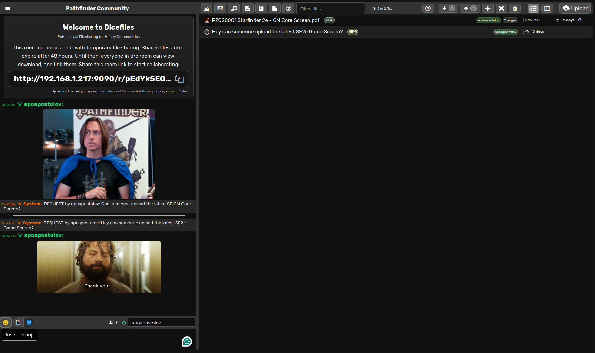
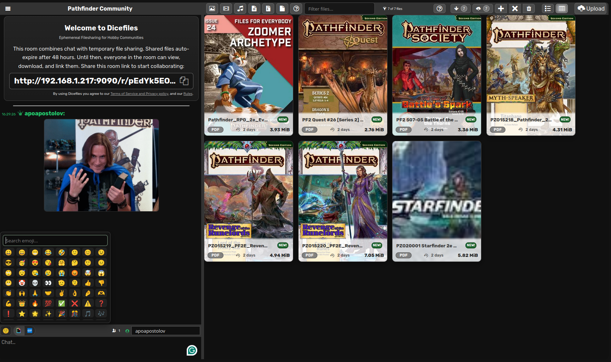

# Dicefiles

**Ephemeral file sharing for hobby communities** — real-time rooms where chat and files live side by side.


Dicefiles is self-hosted software you run for a group that already knows how to share a room link: RPG tables, map packs, board-game PDFs, STL dumps, fiction, session recordings. Files expire on a timer so the host stays lean; accounts, moderation, requests, and automation are there when you need them. It descends from Volafile and Kregfile, rebuilt for long-lived communities and operators who care about control.

There is **no public Dicefiles cloud**. You host it, you own the disk, you choose who gets in.

<p align="center">
  
  
</p>

### From 1.3 to 1.4.2 — what actually changed for people who use rooms

**1.4 is the “daily driver” release.** If you left off on 1.3.x, the automation API and room model are still familiar. What improved is how the room *feels* when it is busy, and how much an owner can wire without leaving the UI.

Rooms with hundreds of files no longer drag the browser into the mud: the list **virtualizes** once it grows large, and heavy tools (PDF/comic readers, archive browser) load only when you open them. Operators run **Node 20+** and **Yarn 1.x** against Redis with a modern client; `/healthz` is honest about Redis, disk, and preview backlog so you know whether the host is fine before your players arrive.

In the room itself, filters and sort **remember your choices** for that room. Gallery **Read Now** gives clear feedback (and **R** on the keyboard). Batch download and archive browsing stop pretending when the queue is empty. GIF search is **Giphy only** — Tenor’s public API is gone.

**1.4.2** is the power-user tooling drop. You can **link other rooms into this one**: finished files appear as **Linked · source name**, open and download through the source, while trash and bans stay where the file was uploaded. The source owner must flip **Allow room cross-linking** first; knowing an id is not consent. Destinations use Room Options → **Linking** (id or exact name, filters by filename, tag, type, age; status Active / Cross-link off / Missing).

The toolbar is tighter: requests open as a **create + board** pill, the filter field fills the middle, and optional **shareable deep links** can land someone on a file, filter, sort, or open request via the URL. Room Options is tabbed so General, Invites, Linking, and Plugins each have a proper home.

Full notes live in [CHANGELOG.md](CHANGELOG.md). Performance detail: [docs/PERF_NOTES.md](docs/PERF_NOTES.md).

---

## What you get in a room

A Dicefiles room is chat plus a living file list. People drop media and documents; others open, download, or batch-grab what they need before TTL prunes finished files. Previews cover images, video, audio, PDFs, and book covers when preview tooling is installed on the host.

**Reading and archives.** PDFs, ePubs, MOBI/AZW, and comics (CBZ/CBR/CB7) open **in the page** from gallery mode — **Read Now**, zoom, keyboard navigation, no extra desktop app. Zip/Rar/7z and friends can be browsed with the **Archive Viewer** so someone can pull one STL out of a bag without downloading the whole archive.

**Requests and links.** When requests are allowed, people can ask for a file and browse open/fulfilled work on a real board, not a buried chat scroll. Chat URLs can land in a **links archive** (optionally with opengraph.io for titles).

**Multi-room linking.** Owners of a destination room subscribe to sources they trust; sources must opt in. Linked rows stay clearly marked so nobody confuses a mirror with a native upload.

**Invites and guests.** Invite-only rooms can mint **guest invite links** (single-use, max uses, or max hours) from Room Options → **Invites**, with copy-to-clipboard and revoke. Guests redeem via `?invite=` and do not become owners.

**Bots and automation.** In-process **plugins** (Room Options → **Plugins**) upload as cyan **BOT** identities — **Mega Autoshare** watches a Mega.nz folder and drops new files into the room. Outside the process you still have scoped **REST** keys, **webhooks**, and an **MCP** bridge for agents. See [Automation](#automation-api-webhooks-and-bots) below.

**People and ops.** Accounts, roles, flood control, profiles with achievement tracks, optional public room directory, automatic room pruning, batch download, “new” badges, and a serious `/healthz` for operators.

---

## Reading files in the browser

Open gallery mode, click a supported book or comic, then **Read Now** (or **R**). The reader takes over the file area; **Escape** or **✕** returns you to the list.

| Format | How it works |
| ------ | ------------ |
| **PDF** | [PDF.js](https://mozilla.github.io/pdf.js/) over HTTP range requests; lazy page decode; zoom and page counter |
| **ePub** | Unpacked in the browser; chapter list; A5-style paging; ←/→ and chapter keys |
| **MOBI / AZW / AZW3** | Same reading UX as ePub, no server conversion |
| **Comics (CBZ / CBR / CB7)** | Sequential pages; CBZ in-browser, CBR/CB7 need host tools (`unrar`, `p7zip`) for best results |

Reading does **not** require GraphicsMagick or Ghostscript. Those tools (plus `exiftool` / `ffmpeg`) only improve **cover thumbnails** in the gallery. See [preview tooling](#15-install-preview-tooling-recommended) under Quick Start.

---

## Profiles

Logged-in users can leave a markdown blurb on their profile. Achievements track uploads (count and size), downloads, and request create/fulfill milestones, with rarity styling from common through mythic tiers. Stats summarize totals so the “trophy room” is readable at a glance. Design notes: [docs/ACHIEVEMENT_SYSTEM.md](docs/ACHIEVEMENT_SYSTEM.md).

---

## Documentation map

| Document | When you need it |
| -------- | ---------------- |
| [docs/INTRODUCTION.md](docs/INTRODUCTION.md) | Longer product walkthrough |
| [docs/README.md](docs/README.md) | Full docs index |
| [CHANGELOG.md](CHANGELOG.md) | Every release in detail |
| [API.md](API.md) | REST automation, scopes, webhooks |
| [MCP.md](MCP.md) | Model Context Protocol / AI clients |
| [core/plugins/DEVELOPING_PLUGINS.md](core/plugins/DEVELOPING_PLUGINS.md) | Writing and wiring plugins |
| [core/plugins/MEGA_FOLDER.md](core/plugins/MEGA_FOLDER.md) | Mega Autoshare setup |
| [docs/FUTURE_DEVELOPMENT_PLAN.md](docs/FUTURE_DEVELOPMENT_PLAN.md) | Backlog (shipped vs proposed) |
| [docs/CONTRIBUTING.md](docs/CONTRIBUTING.md) | Building and contributing |
| [docs/UI_STYLE.md](docs/UI_STYLE.md) | UI conventions for contributors |

Older overhaul and CI notes: [docs/archive/](docs/archive/).

---

## Automation, API, webhooks, and bots

Dicefiles is built so a careful operator can glue Discord bots, n8n, scripts, or an AI client to the same rooms humans use.

- **REST** under `/api/v1` with scoped API keys, rate limits, and audit logging — full reference in [API.md](API.md).
- **Webhooks** fire on uploads, deletes, requests, linked-file appearance, guest invites, and more, with signing and retries.
- **MCP** (`scripts/mcp-server.js`) exposes those capabilities as tools for Claude, Cursor, Codex, and similar clients — see [MCP.md](MCP.md).
- **Plugins** run *inside* the Dicefiles process. Invite them per room under Room Options → **Plugins**, set config, enable, and **Run now**. Uploads show a cyan **BOT** pill and a real bot name (Mega defaults to **Mega Autoshare**).

### Mega Autoshare

1. On the host: `yarn add megajs` (optional dependency), then restart Dicefiles.  
2. In the room: **Room Options → Plugins → invite Mega Autoshare**.  
3. Set the Mega folder URL, poll interval, optional name prefix; save or run once.

New files land in that room under the bot identity. Prefer `MEGA_EMAIL` / `MEGA_PASSWORD` for private folders. Full guide: [core/plugins/MEGA_FOLDER.md](core/plugins/MEGA_FOLDER.md). Custom plugins and hoster roadmap: [DEVELOPING_PLUGINS.md](core/plugins/DEVELOPING_PLUGINS.md), [REMOTE_HOST_IMPORTS.md](core/plugins/REMOTE_HOST_IMPORTS.md).

---

## AI-assisted install (optional)

If you use an agent (OpenClaw, Claude, Codex, and so on) to set up the stack, paste the block below. **Humans** should prefer [Quick Start](#quick-start-choose-your-os).

````
You are setting up Dicefiles on this machine. Work through these steps in order:

## 1 — Clone and install
```bash
git clone https://github.com/apoapostolov/Dicefiles-Ephemereal-Filesharing.git Dicefiles
cd Dicefiles
# Node >= 20 required. Yarn 1.x is the only supported package manager (yarn.lock).
yarn install
```

## 2 — Generate a config
Create `.config.json` from the provided example:
```bash
cp .config.json.example .config.json
```
Open `.config.json` and:
- Replace `"secret"` with 64 random hex characters (run:
  `node -e "console.log(require('crypto').randomBytes(32).toString('hex'))"`)
- Set `"name"` and `"motto"` to taste.
- Set `"port"` (default 9090)
- Add at least one automation API key under `"automationApiKeys"` with scopes
  `["files:read","uploads:write","requests:write","rooms:write"]`.
  Keep the key value in your secrets manager.

## 3 — Build and start
```bash
node ./node_modules/webpack-cli/bin/cli.js --mode=production
node server.js &
curl -sI http://127.0.0.1:$(node -e "const c=require('./.config.json');console.log(c.port||9090)")/ | head -1
```
Confirm `HTTP/1.1 200` before proceeding.

## 4 — Install the MCP server (stdio)
Add the following entry to your MCP client config (`~/.config/mcporter.json`,
`~/.cursor/mcp.json`, `~/.codex/config.toml`, etc. — see `MCP.md` § 2 for
client-specific formats):

```json
{
  "mcpServers": {
    "dicefiles": {
      "command": "node",
      "args": ["/absolute/path/to/Dicefiles/scripts/mcp-server.js"],
      "env": {
        "DICEFILES_BASE_URL": "http://localhost:9090",
        "DICEFILES_API_KEY": "<your-automation-key-from-step-2>"
      }
    }
  }
}
```

Smoke-test:
```bash
DICEFILES_BASE_URL=http://localhost:9090 \
DICEFILES_API_KEY=<your-key> \
node scripts/mcp-server.js
# → [dicefiles-mcp] Stdio transport ready. Waiting for MCP client...
```

## 5 — Install the OpenClaw agent skill
```bash
mkdir -p ~/.claude/skills/dicefiles
cp /absolute/path/to/Dicefiles/scripts/openclaw-dicefiles-skill/SKILL.md \
   ~/.claude/skills/dicefiles/
```
The skill teaches OpenClaw the full 13-tool inventory, startup sequence, and
fulfillment loop. Full skill definition: `scripts/openclaw-dicefiles-skill/SKILL.md`.

## 6 — Verify
- Restart your MCP client and confirm `dicefiles` appears in its tool list.
- Ask the agent: "Use the server_health tool to check my Dicefiles instance."
- Expected: Redis OK, storage OK, uptime counter > 0.
````

---

## Quick Start (Choose Your OS)

### Linux / macOS

**Node.js:**

- Use a current Node.js LTS release
- If you use `nvm`: `curl -o- https://raw.githubusercontent.com/nvm-sh/nvm/v0.40.1/install.sh | bash`

**Windows users: skip to [Windows 11 Setup](#windows-11-setup) below.**

#### 1. Install Redis

**Ubuntu/Debian:**

```bash
sudo apt update
sudo apt install redis-server
sudo systemctl start redis
sudo systemctl enable redis
```

**macOS:**

```bash
brew install redis
brew services start redis
```

Verify Redis is running:

```bash
redis-cli ping
# Should return: PONG
```

#### 1.5 Install Preview Tooling (recommended)

For reliable file previews (especially PDFs), install:

```bash
sudo apt update
sudo apt install -y exiftool ffmpeg graphicsmagick ghostscript p7zip-full

*If you cannot install some of these utilities, the server will still run. "Preview" assets simply won't be generated and your gallery will fall back to the generic file icon — there are no crashes. CB7 comic support requires `p7zip-full`; without it, CB7 files upload successfully but lack previews and reading capabilities.*
```

Notes:

- PDF preview generation uses GraphicsMagick; after install, verify the `gm` command is available (`gm version`).
- If you prefer ImageMagick, install it together with Ghostscript so PDF rendering delegates are available.
- **PDF/ePub/MOBI in-browser reading does not require any of the above tools.** The reader libraries (`pdfjs-dist`, `jszip`, `@lingo-reader/mobi-parser`) are bundled client-side JavaScript. These tools are only needed for generating the small cover thumbnails shown in the file list gallery.

#### 2. Clone and Install

**Requirements:** Node.js **≥ 20**, **Yarn 1.x** (`yarn.lock` only), and a running **Redis** server.

```bash
# Clone the repository
git clone https://github.com/apoapostolov/Dicefiles-Ephemereal-Filesharing.git
cd Dicefiles-Ephemereal-Filesharing

# Install dependencies (Yarn 1.x)
yarn install

# Build client-side code (production mode)
yarn prestart
```

#### 3. Configure

Copy the annotated example and edit it:

```bash
cp .config.json.example .config.json
```

At minimum set `"secret"` to a long random string and choose a `"port"`. See
[Configuration](#configuration) below or the inline comments in `.config.json.example`
for a full description of every option.

#### 4. Start the Server

```bash
yarn start
# equivalent: node server.js
```

Open `http://127.0.0.1:<port>/` using the port from your `.config.json` (common defaults: `8080` in `defaults.js`, or whatever you set — many operators use `10005`).

**Health check:**

```bash
curl -s http://127.0.0.1:<port>/healthz | jq .
# expect: "ok": true and checks.redis.ok true
```

---

### Windows 11 Setup

#### 1. Install Prerequisites

**Node.js (LTS version):**

1. Download a current Node.js LTS release from <https://nodejs.org/>
2. Run the installer (accept defaults)
3. Verify installation:

   ```powershell
   node --version
   ```

**Yarn:**

```powershell
npm install -g yarn
yarn --version
```

**Redis (for Windows):**

**Option A - WSL2 (Recommended for full compatibility):**

1. Enable WSL2: `wsl --install`
2. Install Ubuntu from Microsoft Store
3. In WSL Ubuntu terminal:

   ```bash
   sudo apt update
   sudo apt install redis-server
   sudo service redis-server start
   ```

4. Dicefiles will need to connect to WSL's Redis (IP changes on restart)

**Option B - Memurai (Native Windows Redis):**

1. Download Memurai from <https://www.memurai.com/get-memurai>
2. Install with default settings
3. Memurai installs as a Windows service automatically
4. Verify: `redis-cli ping` (should return `PONG`)

**C++ Compiler (for native modules):**

1. Install Visual Studio Build Tools:
   - Download from <https://visualstudio.microsoft.com/downloads/>
   - Select "Build Tools for Visual Studio 2022"
   - During install, check "Desktop development with C++"

**Optional Preview Tools:**

```powershell
# Install exiftool
# Download from https://exiftool.org/ and extract to a folder in PATH

# Install ffmpeg
# Download from https://ffmpeg.org/download.html
# Extract and add bin folder to PATH

# Install GraphicsMagick (preferred) or ImageMagick + Ghostscript (for PDF previews)
# GraphicsMagick: https://sourceforge.net/projects/graphicsmagick/files/graphicsmagick-binaries/
# ImageMagick: https://imagemagick.org/script/download.php#windows
# Ghostscript: https://ghostscript.com/releases/gsdnld.html

# Install 7-Zip (for CB7 comic support)
# Download from https://www.7-zip.org/
# Extract and add bin folder to PATH
```

#### 2. Clone and Install

Open PowerShell or Command Prompt:

```powershell
# Clone the repository
git clone https://github.com/apoapostolov/Dicefiles-Ephemereal-Filesharing.git
cd dicefiles

# Install dependencies
yarn install

# Build client-side code
yarn prestart
```

#### 3. Configure

Copy the annotated example and edit it:

```powershell
copy .config.json.example .config.json
```

At minimum set `"secret"` and choose a `"port"`. See the inline comments in
`.config.json.example` or the [Configuration](#configuration) section below.

**Note:** `jail` is always disabled on Windows (firejail is Linux-only).

#### 4. Start the Server

```powershell
yarn start
```

Access at `http://127.0.0.1:9090`

---

## Configuration

Configuration files are loaded in this order (last value wins):

1. `defaults.js` - Built-in defaults (do not edit, use as reference)
2. `$HOME/.config/Dicefiles.json`
3. `$HOME/.config/Dicefiles.js`
4. `$PWD/.config.js`
5. `$PWD/.config.json`

### Secret Management

The `secret` config key is used to sign sessions and cookies. **You must change it before deploying to production.**

- If `NODE_ENV=production` and the secret is a known default or shorter than 16 characters, the server will **refuse to start** with a fatal error.
- In development (any other `NODE_ENV`), a warning is logged instead.

**Generate a strong secret:**

```bash
node -e "console.log(require('crypto').randomBytes(32).toString('hex'))"
```

**Set it in `.config.json`:**

```json
{
  "secret": "your-64-char-random-hex-value-here"
}
```

**Secret rotation:** update the `secret` value and restart the server. All existing sessions will be invalidated (users will need to log in again). There is no zero-downtime rotation path at this time.

**Example `.config.json`:**

```json
{
  "name": "My File Share",
  "motto": "Share freely",
  "port": 9090,
  "maxFileSize": 5368709120,
  "jail": false
}
```

**Key options** (full set and comments: `.config.json.example` and `defaults.js`):

| Option | Default | Notes |
| --- | --- | --- |
| `port` | `8080` | HTTP listen port |
| `workers` | conservative | Override if you know your host |
| `secret` | must change | Session signing — generate a long random value |
| `uploads` | `"uploads"` | File store path |
| `maxFileSize` | 10 GB | `0` = unlimited |
| `TTL` | `48` | Hours until finished files expire |
| `downloadMaxConcurrent` | `3` | Batch download concurrency (1–4) |
| `requireAccounts` / `roomCreation` | false / true | Gate chat/upload and new rooms |
| `allowRequests` / `linkCollection` | true | Defaults for new rooms (overridable per room) |
| `allowCrossLinking` | false | Default for new rooms’ source opt-in |
| `automationApiKeys` | `[]` | Scoped REST keys |
| `webhooks` | `[]` | Outbound event hooks |
| `plugins` | `[]` | Optional global plugin load (rooms can still invite bots in UI) |
| `opengraphIoKey` | `""` | Optional link titles; never returned from admin config API |
| `publicRooms` | false | Home page room directory |
| `roomPruning` / `roomPruningDays` | true / 21 | Drop idle rooms |
| `jail` | true on Linux | Firejail around preview tools; always false on Windows |
| `profileActivity` | true | Latest activity on profiles |


### Room Options (owners and mods)

Open **Room Options** from the room chrome. Tabs:

| Tab | What it is for |
| --- | -------------- |
| **General** | Name, MOTD, invite-only, adult, requests, link collection, deep links, allow cross-linking, mod TTL/disable |
| **Invites** | Mint guest links (limits panel: single-use, max users, max hours), list, copy, revoke |
| **Linking** | Subscribe to other rooms’ finished files; filters and live status |
| **Plugins** | Invite bots from the server catalog, edit settings, run or remove |

Defaults that matter for multi-room work: **Allow room cross-linking** is off until the *source* opts in; **Shareable deep links** is off until you want URL intents. Example deep link once enabled:

```text
/r/yourRoom?filter=maps&sort=newest&file=FILEKEY
```

Server-wide `plugins` / `webhooks` arrays in `.config.json` still work for global wiring; most operators will prefer the per-room **Plugins** tab for Mega Autoshare. Details: [Automation](#automation-api-webhooks-and-bots).

## Security

Internet-facing hosts should terminate **HTTPS** at a reverse proxy (or use built-in TLS). Sessions, API keys, and file bytes otherwise travel in the clear. Change `secret` before production; short or default secrets refuse to start when `NODE_ENV=production`.

### HTTP security headers (Helmet)

Dicefiles sets secure defaults on every response. Highlights:

| Header                       | Value                                                                 | Notes                                                            |
| ---------------------------- | --------------------------------------------------------------------- | ---------------------------------------------------------------- |
| `Content-Security-Policy`    | `default-src 'self' 'unsafe-inline'` + `script-src ... 'unsafe-eval'` | `unsafe-eval` required for PDF.js PostScript rendering           |
| `Strict-Transport-Security`  | `max-age=15552000; includeSubDomains`                                 | Sent **only** when the request arrived over HTTPS (`req.secure`) |
| `X-Frame-Options`            | `SAMEORIGIN`                                                          | Prevents clickjacking                                            |
| `X-Content-Type-Options`     | `nosniff`                                                             | Prevents MIME-type sniffing                                      |
| `Referrer-Policy`            | `no-referrer`                                                         | No referrer leaked to external URLs                              |
| `Cross-Origin-Opener-Policy` | `same-origin`                                                         | Isolates browsing context                                        |

To verify headers on a live instance:

```bash
curl -sI https://your-instance/ | grep -i "content-security\|strict-transport\|x-frame\|x-content"
```

### Ports

| Protocol | Default port | Config key |
| -------- | ------------ | ---------- |
| HTTP     | `8080`       | `port`     |
| HTTPS    | `8443`       | `tlsport`  |

Change either in `.config.json`. If you run Dicefiles behind a reverse proxy (nginx/caddy), set the proxy to forward to the HTTP port and terminate TLS at the proxy layer.

### HTTPS for production

A typical install speaks plain HTTP on `port`. For anything on the public internet, put TLS in front (or enable built-in TLS).

**Option A — Reverse proxy (recommended)**

Place nginx, Caddy, or another edge proxy in front of port `8080` and have it forward HTTPS traffic:

```nginx
server {
    listen 443 ssl;
    server_name files.example.com;

    ssl_certificate     /etc/letsencrypt/live/files.example.com/fullchain.pem;
    ssl_certificate_key /etc/letsencrypt/live/files.example.com/privkey.pem;

    location / {
        proxy_pass http://127.0.0.1:8080;
        proxy_set_header Host              $host;
        proxy_set_header X-Forwarded-For  $proxy_add_x_forwarded_for;
        proxy_set_header X-Forwarded-Proto $scheme;
    }
}
```

The `Strict-Transport-Security` header is only emitted when Dicefiles detects `req.secure` — i.e. when the proxy sets `X-Forwarded-Proto: https`. Configure your proxy accordingly.

**Option B — Built-in TLS**

Set `tlsport`, `tlsCert`, and `tlsKey` in `.config.json` to use Node's built-in HTTPS listener for direct TLS termination:

```json
{
  "tlsport": 443,
  "tlsCert": "/etc/letsencrypt/live/files.example.com/fullchain.pem",
  "tlsKey": "/etc/letsencrypt/live/files.example.com/privkey.pem"
}
```

**What is at risk without HTTPS:**

| Asset                                 | Risk over plain HTTP                          |
| ------------------------------------- | --------------------------------------------- |
| Session cookie (`connect.sid`)        | Stolen → account takeover                     |
| Automation API bearer token           | Stolen → full API access at that key's scopes |
| Uploaded file content                 | Intercepted in transit                        |
| Login credentials (password at login) | Captured by a MITM on the same network        |

### Firejail Sandboxing

On Linux, preview-generation commands (`exiftool`, `ffmpeg`, `file`) run inside a [Firejail](https://github.com/netblue30/firejail) sandbox by default (`jail: true`). The server logs the sandbox status at startup:

```
[security] Firejail sandbox: active (jail=true, binary found)
```

If Firejail is not installed, the server logs a warning and falls back to unsandboxed execution. To intentionally disable sandboxing (e.g., in Docker or restricted environments):

```json
{ "jail": false }
```

## Automation API (quick pointer)

Stable base path: **`/api/v1`** (legacy `/api/automation` still aliases). Discovery for agent protocols is at `/.well-known/a2a`. Full contract, scopes, and webhook payloads: **[API.md](API.md)**. MCP tool bridge: **[MCP.md](MCP.md)**. In-room bots: [Automation, API, webhooks, and bots](#automation-api-webhooks-and-bots).

## Health endpoint

`GET /healthz` returns Redis and storage checks, disk free/total when available, preview-queue depth, uptime, and simple counters. **200** means ready; **503** means a dependency check failed. File **TTL** and **downloadMaxConcurrent** are server config only (not Room Options).

See `defaults.js` for all available options.

### GIF Provider API Key (Giphy)

Chat GIF search uses **Giphy** only. Google discontinued the public **Tenor API** on
**2026-06-30** (see [Tenor support](https://support.google.com/tenor/answer/10455265));
that provider was removed from Dicefiles. Existing Tenor media URLs in chat still
embed when possible.

1. Edit `core/gif-providers.json` only for non-secret defaults (`limit`, `rating`, etc.).
2. Create a local secret override file in the project root:

```json
{
  "giphy": {
    "apiKey": "YOUR_GIPHY_API_KEY"
  }
}
```

Use file name: `.gif-providers.local.json`

- This file is git-ignored and should not be committed.
- Webpack merges `.gif-providers.local.json` into `core/gif-providers.json` at build time.
- `giphy.rating` defaults to `r` (mature). Valid values are: `g`, `pg`, `pg-13`, `r`.
- Rebuild client assets after changing keys:

```bash
yarn prestart
```

## Windows Service Setup (NSSM)

To run Dicefiles as a Windows service that starts automatically and stays alive:

### 1. Install NSSM (Non-Sucking Service Manager)

1. Download from <https://nssm.cc/download>
2. Extract the archive
3. Run `nssm.exe` from the `win64` folder (or move it to a folder in your PATH)

### 2. Create the Service

Open Command Prompt as Administrator and run:

```cmd
nssm install Dicefiles
```

This will open the NSSM GUI. Configure:

**Path:**

- Path to `node.exe`:

  ```
  C:\Program Files\nodejs\node.exe
  ```

  (or wherever Node.js is installed)

**Startup directory:**

- The Dicefiles directory:

  ```
  C:\path\to\Dicefiles
  ```

**Arguments:**

- The server script:

  ```
  C:\path\to\Dicefiles\server.js
  ```

### 3. Configure Service Settings (Optional but Recommended)

In the NSSM GUI, click the tabs:

**Details tab:**

- Display name: `Dicefiles`
- Description: `File sharing chat platform`
- Startup type: `Automatic`

**Log on tab:**

- Use the default "Local System account" (recommended for file access)
- Or use a dedicated service account if you prefer

**I/O tab (for logging):**

- **Output (stdout):** `C:\path\to\Dicefiles\Dicefiles-out.log`
- **Error (stderr):** `C:\path\to\Dicefiles\Dicefiles-err.log`

This will capture logs for troubleshooting.

### 4. Start and Test the Service

```cmd
nssm start Dicefiles
```

Check the status:

```cmd
nssm status Dicefiles
```

Access at `http://127.0.0.1:9090`

### 5. Managing the Service

```cmd
# Stop the service
nssm stop Dicefiles

# Restart the service
nssm restart Dicefiles

# Remove the service (will stop it first)
nssm remove Dicefiles confirm
```

### 6. Configure Redis as a Service

**If using Memurai:** It should already be installed as a Windows service.

**If using WSL2 Redis:** Redis won't survive WSL restarts. Consider:

- Using Memurai instead for production
- Setting up a startup script that launches WSL and starts Redis

### Troubleshooting Windows Service Issues

1. **Service won't start:** Check the error log at `Dicefiles-err.log`
2. **Port already in use:** Change port in `.config.json` and restart service
3. **Redis connection refused:** Verify Redis is running before starting Dicefiles
4. **Permission errors on uploads:** Ensure the service account has write access to the uploads directory

## Development

### Setting Up Development Mode

Run these commands in separate terminals:

**Terminal 1:**

```bash
yarn pack
```

This starts webpack in watch mode and rebuilds client code automatically when files change.

**Terminal 2:**

```bash
npx nodemon server.js
```

This restarts the server automatically when server files change.

Client browsers will automatically reconnect and pull new code on reload.

## Usage

### Creating Rooms

Rooms are created automatically when someone navigates to a room URL (e.g., `http://localhost:9090/yourroomname`).

To force-create a room manually:

```bash
redis-cli set rooms:<alias> 1
# Example:
redis-cli set rooms:gentoomen 1
```

### Creating Moderators

Use the included script to promote a user to moderator:

```bash
node setRole.js <username> mod
```

The user should refresh their browser tab to see the new role.

## Production Deployment

### Linux Process Management (PM2)

Use PM2 to keep Dicefiles running:

```bash
npm install -g pm2
pm2 start server.js --name Dicefiles
pm2 startup
pm2 save
```

### Using TLS/HTTPS

Update your config file:

```json
{
  "tls": true,
  "tlsonly": false,
  "tlsport": 8443,
  "tlskey": "/path/to/privkey.pem",
  "tlscert": "/path/to/cert.pem"
}
```

Use certbot (Let's Encrypt) or your certificate authority to get certificates.

**Windows users:** Use IIS ARR or nginx on WSL2 as a reverse proxy for HTTPS termination.

### Using a Reverse Proxy (Recommended for Linux/macOS)

For production, use nginx or Apache as a reverse proxy. Example nginx config:

```nginx
server {
    listen 80;
    server_name your-domain.com;

    location / {
        proxy_pass http://127.0.0.1:9090;
        proxy_http_version 1.1;
        proxy_set_header Upgrade $http_upgrade;
        proxy_set_header Connection "upgrade";
        proxy_set_header Host $host;
        proxy_set_header X-Real-IP $remote_addr;
        proxy_set_header X-Forwarded-For $proxy_add_x_forwarded_for;
    }
}
```

## Troubleshooting

### Previews don't work

1. Verify all prerequisites are installed:

   ```bash
   which exiftool ffmpeg file
   ```

1. If using a container/VPS/Docker, firejail may refuse to run. Disable it in config:

   ```json
   {
     "jail": false
   }
   ```

1. Windows users: Ensure exiftool, ffmpeg, and imagemagick are in your PATH.

1. Check server logs for preview-related errors.

### Files don't upload

1. Check upload directory permissions
2. Verify `maxFileSize` config is sufficient
3. Check available disk space
4. Windows service users: Verify the service account has write access

### Can't connect

1. Verify Redis is running: `redis-cli ping`
2. Check port is not blocked by firewall
3. Review server logs for startup errors
4. Windows: Check Windows Firewall is allowing Node.js

### Windows-specific Issues

**"redis-cli not found":** Make sure Memurai is installed and in PATH, or use WSL2 Redis.

**"gyp ERR! stack Error: `msbuild` not found":** Install Visual Studio Build Tools with C++ workload.

**Service fails to start:** Check the error log at `Dicefiles-err.log`.

## Repository layout

| Path | Role |
| ---- | ---- |
| `client/` | Browser app |
| `lib/` | Server, plugins, rooms, upload |
| `core/` | Shared product assets (GIF providers, plugin docs) |
| `docs/` | Guides and backlog |
| `views/` | EJS templates |
| `static/` | Built assets |
| `server.js` | Entry |
| `defaults.js` | Default config reference |

## Contributing

See [docs/CONTRIBUTING.md](docs/CONTRIBUTING.md).

## License

MIT — inspired by [volafile](https://volafile.org).
