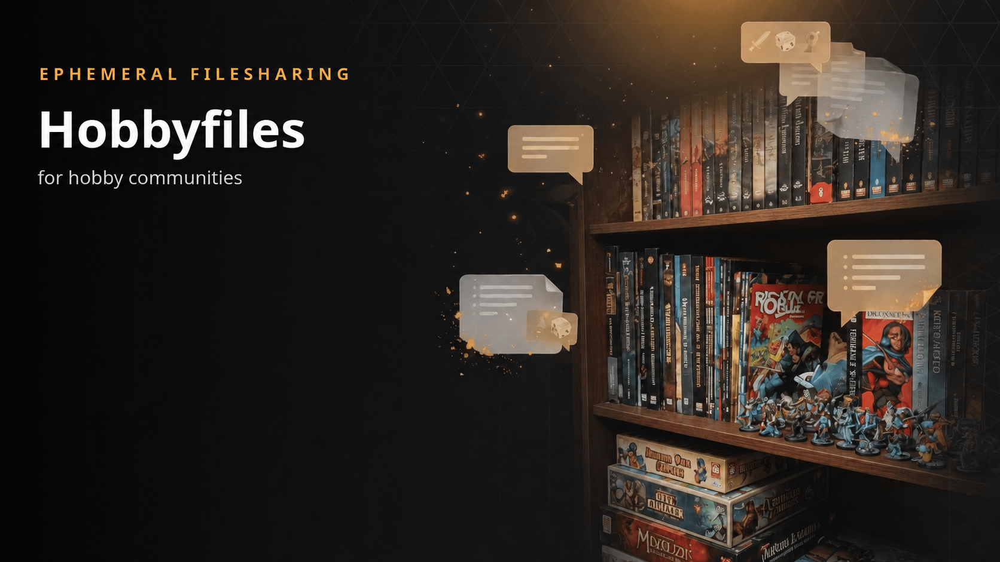
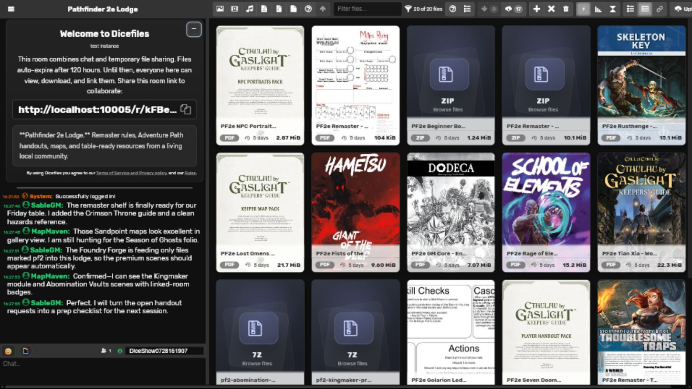
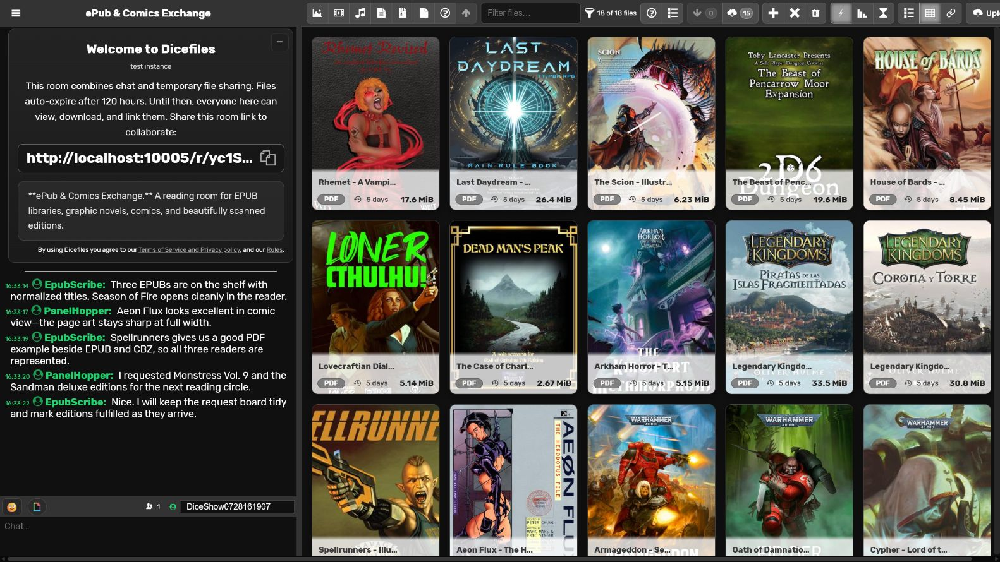
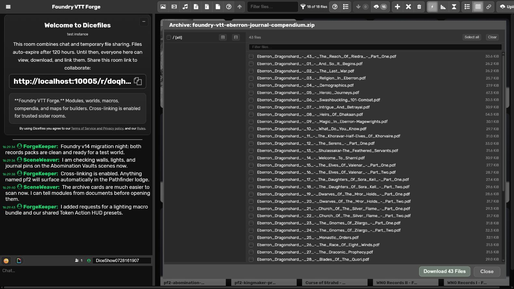
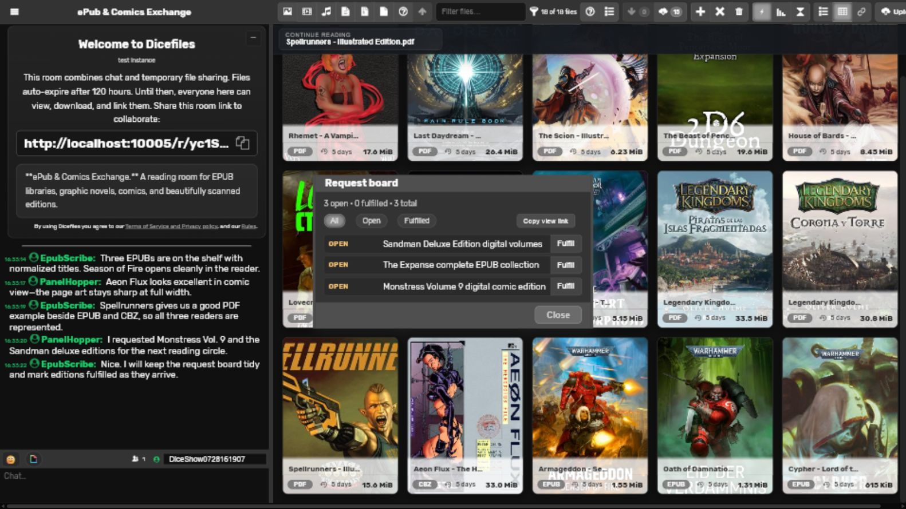
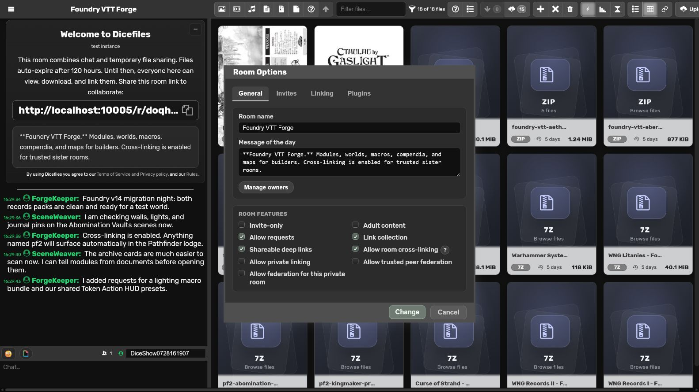
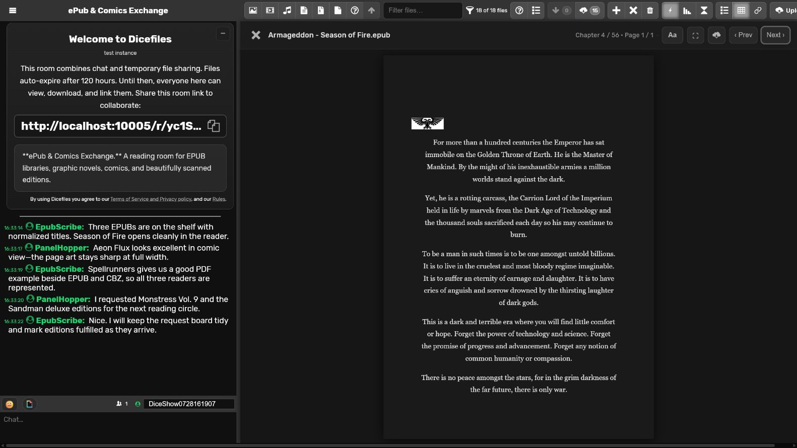
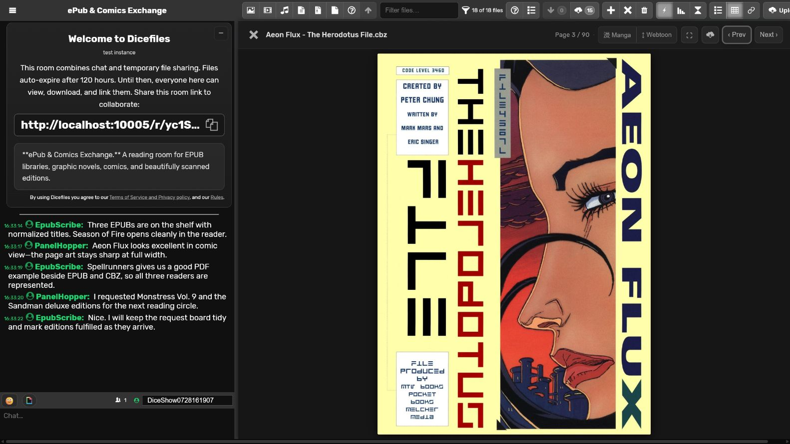
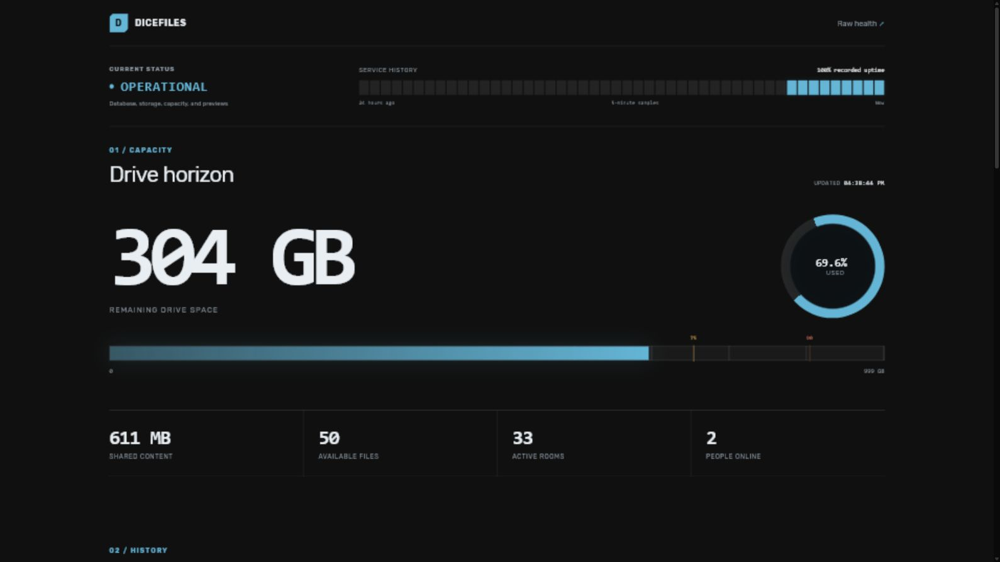

<!-- markdownlint-disable MD033 -->

<div align="center">

  <h1>Dicefiles</h1>

  <p>Host a community room where people can share, find, request, and read files together.</p>

  <p>
    <a href="#readme"></a>
    <a href="./package.json"></a>
    <a href="https://github.com/apoapostolov/Dicefiles-Ephemereal-Filesharing/releases/latest"></a>
    <a href="https://github.com/apoapostolov/Dicefiles-Ephemereal-Filesharing/releases/latest"></a>
  </p>

</div>

<div align="center">
  <a href="https://github.com/apoapostolov/Dicefiles-Ephemereal-Filesharing">
    </a>
</div>

Dicefiles is built for collections people actively browse and discuss: RPG
books and maps, board games, STL models, comics, fiction, and other hobby media.
Each room combines live chat, temporary file sharing, requests, readers,
moderation, and optional automation without feeling like a generic cloud-drive
dashboard. You host it; there is no public Dicefiles service.

<p align="center">
  
</p>

## What's New in 1.4.6

This release closes the remaining gap in upload parsing: archives now go
through the same sandbox as other file metadata tools. It also keeps server
fetches from reaching private addresses and puts time and output limits on
external parsers. For people running Dicefiles with automation, MCP HTTP is now
stateless and binds to loopback unless explicitly configured otherwise.

Room data needs no migration. Operators using MCP HTTP should read the
[upgrade notes](CHANGELOG.md#upgrade-notes); the full [changelog](CHANGELOG.md)
has the security and client details.

## What You Can Do

- **Share around a live conversation.** Combine chat, uploads, inline media, Giphy, moderation, and configurable retention in one room.
- **Browse instead of digging through filenames.** Switch between compact lists and galleries with generated covers, filters, search, tags, and remembered views.
- **Read without downloading first.** Open PDF, ePub, MOBI/AZW, and CBZ/CBR/CB7 comics in the room with progress and keyboard navigation.
- **Look inside archives.** Browse ZIP, RAR, 7Z, TAR, multipart archives, and comics, then extract only the entry you need.
- **Ask the community for missing material.** Post requests, attach reference links or images, and let an upload fulfill the request directly.
- **Join libraries without copying them.** Link approved rooms locally or across trusted independent hosts while the source keeps control.
- **Protect private communities.** Use expiring guest invites, optional rotating room passwords, consent boundaries, and role-based moderation.
- **Connect tools and room bots.** Use scoped REST, webhooks, 49 MCP tools,
  and bounded automation for imports, releases, requests, and commands.
- **Grow beyond one drive.** Add several volumes, set free-space floors,
  monitor health, and keep legacy content where it already lives.
- **Choose your workspace colors.** Pick from 34 persistent themes, including
  26 dark palettes, using Appearance.
- **Explore torrents.** Import magnets and `.torrent` files, browse searchable
  contents and artwork, check reported availability, and stream supported videos.
- **Watch movies and episodes.** Resume long videos, match clear torrent titles automatically or choose a catalogue result,
  browse artwork and cast, and add subtitles in your language.

<p align="center">
  
  
</p>

## Rooms Made for Communities

Room owners can control visibility, retention, requests, deep links, linked
libraries, plugins, invitations, and access without leaving the room. Members
can quickly switch to files added since their last visit or download All, New,
or Since Last Visit through a resumable queue.

The optional public directory exposes only rooms that opt in. Profiles collect
activity, contribution statistics, and achievement tracks for uploads,
downloads, and fulfilled requests.

<p align="center">
  
  
</p>

## Built-in Readers

- **PDF:** lazy page rendering, range requests, zoom, progress, and download.
- **ePub:** A5-style pages, chapter navigation, typography controls, and soft page curls.
- **MOBI / AZW / AZW3:** browser-side parsing with the same paginated reading view.
- **Comics:** sequential CBZ, CBR, and CB7 pages with keyboard navigation.

PDF, ePub, and MOBI reading runs in the browser. Native tools are used only for
server-generated previews and formats such as RAR/7Z extraction.

<p align="center">
  
  
</p>

## Quick Start

Requirements: Node.js 22.13+ or 24+, Yarn 1.x, Redis, and a Linux, macOS, WSL, or
Windows host. Yarn is the supported package manager; use the committed
`yarn.lock`.

```bash
git clone https://github.com/apoapostolov/Dicefiles-Ephemereal-Filesharing.git
cd Dicefiles-Ephemereal-Filesharing
yarn install --production=false
cp .env.example .env
```

Edit `.env` before the first start: set a unique random `DICEFILES_SECRET`
and `HTTP_PORT=8080`. Generate a secret with `openssl rand -hex 32`.
Then run `yarn start` (which builds assets before starting). Open
`http://127.0.0.1:8080`. See [environment configuration](docs/ENVIRONMENT.md)
for ordered flags/keys and precedence. Advanced settings remain in strict JSON
`.config.json`; the annotated `.config.json.example` requires removing its comments.

On Ubuntu, Debian, or WSL, `yarn setup:ubuntu` installs dependencies, checks the
native preview stack, and builds the client. On other systems, install ExifTool,
Ghostscript, Poppler, FFmpeg, and 7-Zip for the broadest
preview and archive support; then run `yarn check:preview-tools`.
Linux sandboxing also needs firejail, and RAR extraction needs unrar. Debian
installations may need to enable non-free repositories for unrar.

Build with development dependencies installed, even when `NODE_ENV=production`.
The webpack toolchain is in `devDependencies`; a production-only install is
appropriate after assets have been built.

Verify the live service:

```bash
curl -s http://127.0.0.1:8080/healthz
```

Production deployments should place Dicefiles behind an HTTPS reverse proxy.
Never commit `.config.json`, API keys, room credentials, federation private
keys, or generated capability URLs.

## Docker: build and run

Use Docker Engine with Compose, or Docker Desktop in Linux-container mode:

```bash
docker build -t dicefiles:local .
cp .env.docker.example .env.docker
```

Set a unique random `DICEFILES_SECRET` in `.env.docker`, then start the stack:

```bash
docker compose --env-file .env.docker up -d --no-build
docker compose --env-file .env.docker ps
curl -fsS http://127.0.0.1:8080/healthz
```

Docker Desktop shows the **dicefiles** project in Containers. The app listens
on loopback port 8080; Redis and uploads use separate persistent volumes.
To use a published GHCR build, set `DICEFILES_IMAGE` to
`ghcr.io/apoapostolov/dicefiles-ephemereal-filesharing:TAG`, run
`docker compose --env-file .env.docker pull`, then `up -d --no-build`.

The [Docker guide](docs/DOCKER.md) covers the complete recipe, GHCR publication,
configuration, backups, upgrades and preview sandbox limitations. The default
container disables external file tools until a dedicated sandbox policy is
validated. Browser readers and image previews remain available. Do not use
privileged containers to bypass this limitation.

## Automation and Operations

The REST API and MCP server cover room discovery, uploads, metadata, requests,
archives, links, guest invites, federation, bots, storage, and protected-room
access. Permissions are split into scopes, rate limited, and audited.

- [REST API reference](./API.md)
- [MCP setup and 49-tool reference](./MCP.md)
- [Trusted-host federation](./docs/FEDERATION.md)
- [Plugin development](./core/plugins/DEVELOPING_PLUGINS.md)
- [Operations skill for AI agents](./skills/dicefiles-ops/SKILL.md)
- [Environment flags and private provider keys](./docs/ENVIRONMENT.md)
- [Appearance and theme tokens](./docs/THEMES.md)
- [Magnet and torrent metadata](./docs/TORRENTS.md)
- [Movies, streaming and subtitles](./docs/MOVIES.md)
- [Security policy](./SECURITY.md)

The protected operator dashboard reports capacity, uptime, traffic, requests,
and service health without exposing filesystem paths or secrets.

<p align="center">
  
</p>

## Development

```bash
yarn lint
yarn test
yarn prestart
```

Contributor workflow and release checks live in [`dev/README.md`](./dev/README.md).
The complete documentation index is [`docs/README.md`](./docs/README.md).

Dicefiles is licensed under MIT. It began as a fork of
[droppy](https://github.com/silverwind/droppy) and now includes substantial new
community, reading, automation, storage, and federation systems.
